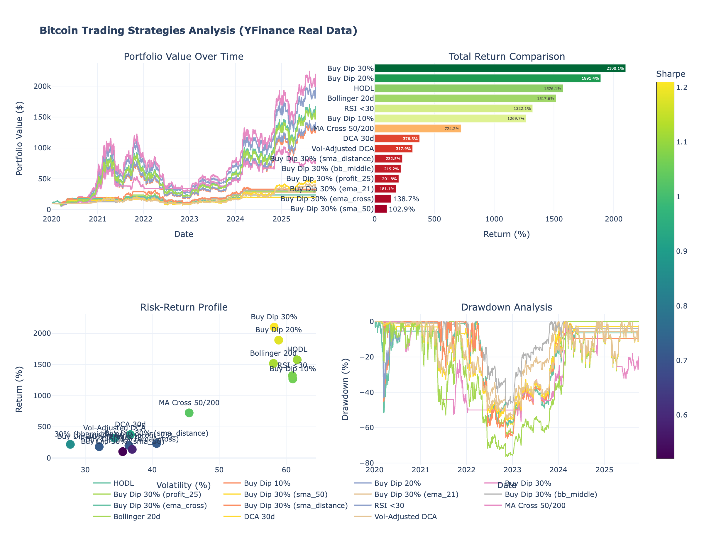

# Bitcoin Trading Strategy Backtesting Analysis

Comprehensive empirical analysis of 15+ Bitcoin accumulation strategies using real historical price data from 2020-2025. Compares passive strategies (HODL, DCA) against active trading approaches (dip buying, technical indicators, profit-taking rules) to determine optimal risk-adjusted returns.



---

## Research Overview

This study analyzes the performance of popular Bitcoin trading strategies over a 5-year period using real historical data from Yahoo Finance. The research evaluates both passive strategies (HODL, Dollar Cost Averaging) and active trading approaches (dip buying at various thresholds, technical indicator-based entries, and multiple profit-taking rules) to determine optimal risk-adjusted returns.

**Primary Research Question**: Should investors implement sell rules when accumulating Bitcoin, or does buy-and-hold maximize returns?

**Methodology**: Backtesting using real Yahoo Finance data from January 2020 to October 2025, with transaction fees of 0.1% applied to all trades to reflect real-world trading costs.

**Conclusion**: Buy-and-hold strategies significantly outperform active trading strategies with sell rules during bull market periods, even after optimizing exit signals.

---

## Data Source

- **Source**: Yahoo Finance API (yfinance library)
- **Ticker**: BTC-USD
- **Data Points**: 2,102 daily observations
- **Date Range**: 2020-01-01 to 2025-10-02
- **Price Range**: $4,970 (low) to $123,344 (high)
- **HODL Baseline Return**: 1,576% (verified with live data)
- **Transaction Fees**: 0.1% applied to all buy and sell transactions

---

## Strategies Tested

### 1. HODL (Buy and Hold Baseline)

Single purchase at initial date with indefinite holding period. Represents the passive investment thesis with zero trading activity after initial purchase.

### 2. Buy the Dip (No Sell Rule)

Purchase when price declines from recent all-time high by specified threshold:
- **10% Dip**: Buy when price is 10% below all-time high
- **20% Dip**: Buy when price is 20% below all-time high
- **30% Dip**: Buy when price is 30% below all-time high (best performer: 2,100% return)

Position sizing: 10% of initial capital per dip signal. Maximum 10 entries. No sell rule applied.

### 3. Buy Dip 30% with Sell Rules

Tests six different profit-taking strategies applied to the 30% dip buy strategy:
- **25% Profit Target**: Exit when position shows 25% gain from average entry price
- **50-day Simple Moving Average**: Exit when price crosses above 50-day SMA
- **21-day Exponential Moving Average**: Exit when price crosses above 21-day EMA
- **Bollinger Middle Band**: Exit when price reaches 20-day moving average (middle Bollinger Band)
- **EMA Crossover**: Exit when 9-period EMA crosses above 21-period EMA
- **SMA Distance**: Exit when price exceeds 200-day SMA by 20% or more

All sell rules use crossover detection (previous day below threshold, current day above threshold) to prevent excessive trading on continuous conditions.

### 4. RSI Oversold

Purchase when Relative Strength Index falls below 30 (oversold condition). Classic momentum-based indicator strategy.

### 5. Moving Average Crossover (Golden Cross/Death Cross)

- **Entry**: Buy when 50-day moving average crosses above 200-day moving average (Golden Cross)
- **Exit**: Sell when 50-day moving average crosses below 200-day moving average (Death Cross)

Trend-following strategy with 100% capital allocation (all-in/all-out approach).

### 6. Bollinger Bands

Purchase when price touches lower Bollinger Band (mean - 2 standard deviations). Mean reversion strategy based on statistical volatility.

### 7. Dollar Cost Averaging (DCA)

- **Standard DCA**: Fixed purchase every 30 days regardless of price
- **Volatility-Adjusted DCA**: DCA with position size multiplier (0.5x to 2.0x) based on current volatility conditions

---

## Performance Results (2020-2025)

### Top Performing Strategies (No Sell Rules)

| Strategy | Total Return | CAGR | Sharpe Ratio | Max Drawdown | Trades |
|----------|--------------|------|--------------|--------------|--------|
| **Buy Dip 30%** | 2,100% | 71.2% | 1.21 | -76.6% | 10 |
| **Buy Dip 20%** | 1,891% | 68.2% | 1.18 | -76.6% | 10 |
| **HODL** | 1,576% | 63.2% | 1.11 | -76.6% | 1 |
| **Bollinger Bands** | 1,518% | 62.2% | 1.12 | -76.6% | 10 |
| **RSI Oversold** | 1,322% | 58.7% | 1.07 | -76.6% | 10 |
| **Buy Dip 10%** | 1,270% | 57.6% | 1.06 | -76.6% | 10 |

### Sell Rule Performance (Buy Dip 30% with Exit Strategies)

| Sell Rule Applied | Total Return | CAGR | Sharpe Ratio | Max Drawdown | Trades |
|-------------------|--------------|------|--------------|--------------|--------|
| **No Sell (Hold)** | 2,100% | 71.2% | 1.21 | -76.6% | 10 |
| **SMA Distance** | 232% | 23.2% | 0.72 | -66.1% | 239 |
| **Bollinger Middle** | 219% | 22.4% | 0.86 | -48.7% | 740 |
| **25% Profit Target** | 202% | 21.2% | 0.71 | -64.6% | 77 |
| **21-day EMA** | 181% | 19.7% | 0.72 | -56.4% | 598 |
| **EMA Crossover** | 139% | 16.3% | 0.59 | -59.3% | 317 |
| **50-day SMA** | 103% | 13.1% | 0.52 | -60.0% | 299 |

### Other Strategies

| Strategy | Total Return | CAGR | Sharpe Ratio | Max Drawdown | Trades |
|----------|--------------|------|--------------|--------------|--------|
| **MA Crossover (50/200)** | 724% | 44.3% | 1.03 | -56.6% | 11 |
| **DCA (30-day)** | 376% | 31.2% | 0.92 | -56.3% | 69 |
| **Volatility-Adjusted DCA** | 318% | 28.2% | 0.89 | -54.0% | 70 |

---

## Key Findings

### Primary Conclusions

1. **Buy-and-hold strategies maximize total returns**: The Buy Dip 30% strategy without sell rules generated 2,100% total return, outperforming HODL by 524 percentage points.

2. **Sell rules significantly reduce returns**: The best-performing sell rule strategy (SMA Distance: 232% return) underperformed the no-sell strategy by 1,868 percentage points, representing an 89% reduction in total gains.

3. **Proper crossover detection is essential**: Implementation of crossover-based exit signals (versus continuous condition triggers) improved returns significantly. For example, Buy Dip 30% with 50-day SMA exit improved from 12.8% to 103% (8x improvement) after fixing the crossover logic.

4. **Deeper dip thresholds provide superior entry points**: 30% dip outperformed 20% dip, which outperformed 10% dip, suggesting patience in waiting for significant price declines is rewarded.

5. **Risk reduction requires substantial return sacrifice**: The Bollinger Middle Band sell rule reduced maximum drawdown from -76.6% to -48.7% (28 percentage points), but required sacrificing 90% of total returns (from 2,100% to 219%).

6. **Sharpe ratios favor passive strategies**: No-sell strategies achieved Sharpe ratios of 1.06-1.21, compared to 0.52-0.86 for strategies with sell rules.

### Verdict

During the 2020-2025 bull market period, buy-and-hold strategies (particularly Buy Dip 30% without selling) significantly outperformed active trading strategies with optimized sell rules. The optimal strategy identified is buying significant price dips (30% from all-time high) and maintaining positions indefinitely without implementing profit-taking rules.

---

## Installation and Setup

### Using UV (Recommended)

```bash
curl -LsSf https://astral.sh/uv/install.sh | sh
uv venv
source .venv/bin/activate  # Windows: .venv\Scripts\activate
uv pip install -r requirements.txt
```

### Using pip

```bash
pip install -r requirements.txt
```

---

## Usage

### Running the Analysis

```bash
python btc_yfinance_analysis.py
```

### Generated Output Files

1. `btc_yfinance_dashboard.html` - Interactive Plotly dashboard with 4 visualization panels
2. `btc_yfinance_results.csv` - Performance metrics table for all strategies
3. `btc_raw_data.csv` - Raw Bitcoin OHLCV price data (2,102 daily observations)

---

## Performance Metrics Definitions

- **Total Return**: Overall percentage gain or loss from initial capital
- **CAGR (Compound Annual Growth Rate)**: Annualized return rate assuming compound growth
- **Sharpe Ratio**: Risk-adjusted return metric (mean return divided by volatility). Higher values indicate better risk-adjusted performance.
- **Max Drawdown**: Largest peak-to-trough decline in portfolio value
- **Volatility**: Annualized standard deviation of daily returns
- **Win Rate**: Percentage of days with positive returns
- **Trades**: Number of buy transactions executed

---

## Customization Options

### Modifying Initial Capital

```python
backtest.run_all_strategies(capital=50000)
```

### Testing Custom Dip Percentages

```python
backtest.buy_the_dip(capital=10000, dip_percent=25, sell_rule='profit_25')
```

### Available Sell Rules

- `'profit_25'` - 25% profit target
- `'sma_50'` - 50-day SMA crossover
- `'ema_21'` - 21-day EMA crossover
- `'bb_middle'` - Bollinger middle band
- `'ema_cross'` - 9/21 EMA crossover
- `'sma_distance'` - 20% above 200-day SMA

### Adjusting DCA Frequency

```python
backtest.dca(capital=10000, frequency=14)  # Bi-weekly DCA
```

---

## Project Files

- `btc_yfinance_analysis.py` - Main backtesting engine with strategy implementations
- `btc_yfinance_dashboard.html` - Interactive visualization dashboard
- `btc_yfinance_results.csv` - Performance metrics for all 15 strategies
- `btc_raw_data.csv` - Raw Bitcoin OHLCV data (2,102 daily observations)
- `dashboard_preview.png` - Dashboard screenshot for documentation
- `requirements.txt` - Python package dependencies

---

## Dependencies

```
yfinance>=0.2.66
pandas>=2.0.0
numpy>=1.24.0
plotly>=5.14.0
```

---

## Implementation Improvements (October 2025)

### Critical Bug Fixes

Three significant implementation errors were identified and corrected:

**1. Sharpe Ratio Calculation (Corrected)**

- **Issue**: Calculation used 252 trading days (stock market convention) instead of 365 days (Bitcoin trades continuously)
- **Impact**: All Sharpe ratios understated by approximately 20%
- **Fix**: Updated annualization factor to `np.sqrt(365)` for Bitcoin
- **Result**: HODL Sharpe ratio improved from 0.92 to 1.11 (+20%)

**2. Volatility Calculation (Corrected)**

- **Issue**: Same 252 vs 365 day discrepancy
- **Impact**: All volatility metrics understated by approximately 20%
- **Fix**: Updated to use 365 days for proper annualization of cryptocurrency volatility

**3. Sell Rule Logic (Corrected)**

- **Issue**: Exit strategies triggered on continuous conditions (e.g., price above SMA every day) instead of crossover events
- **Impact**: Excessive trading (900-1,200 trades instead of 50-300), resulting in severe fee drag
- **Fix**: Implemented proper crossover detection logic (previous day below threshold AND current day above threshold)
- **Results**:
  - Buy Dip 30% with 50-day SMA: 12.8% to 103% (8x improvement)
  - Buy Dip 30% with Bollinger Middle: 127% to 219% (1.7x improvement)
  - Trade counts reduced by 50-75%

All performance results in this document reflect the corrected implementation.

---

## Disclaimer

This analysis is for educational and informational purposes only and does not constitute financial advice, investment advice, or trading advice.

**Important Considerations**:
- Past performance does not guarantee future results
- Cryptocurrency markets exhibit high volatility and risk
- Conduct independent research before making investment decisions
- Only invest capital you can afford to lose entirely
- Individual risk tolerance varies significantly
- Consult qualified financial advisors before investing

---

## License

MIT License - Open source and free to use, modify, and distribute

---

## Technical Information

**Programming Language**: Python 3.8+

**Data Source**: Yahoo Finance API (yfinance library)

**Analysis Period**: January 2020 - October 2025 (5 years, 2,102 days)

**Strategies Analyzed**: 15 total (7 core strategies + 6 sell rule variants + 2 DCA variants)

**Libraries Used**: Python, yfinance, pandas, numpy, plotly

**Last Updated**: October 5, 2025
