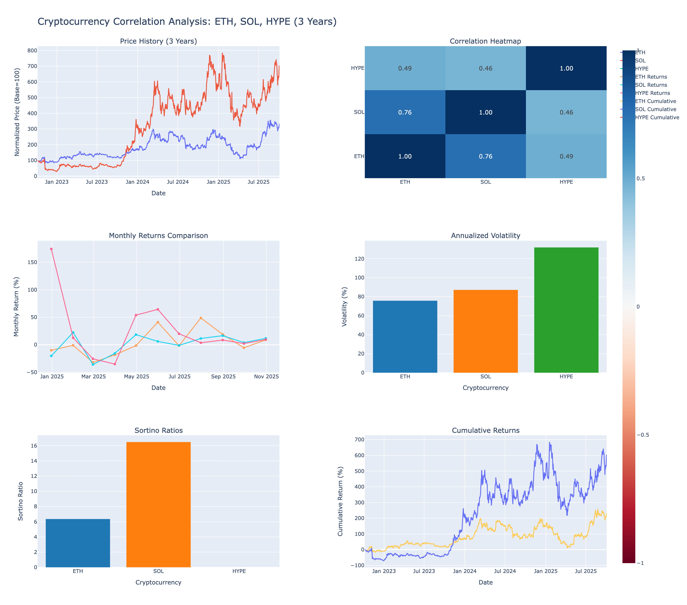

# Cryptocurrency Market Analysis & Trading Signals

Comprehensive quantitative analysis of cryptocurrency markets, focusing on capital rotation, correlation patterns, and trading strategy development. Uses live data from Yahoo Finance to analyze BTC, ETH, SOL, and HYPE.



---

## 📊 Analysis Reports

### 1. [Capital Rotation Exit Signals](reports/CAPITAL_ROTATION_EXIT_SIGNALS.md) ⭐ **Trading Strategy**

**Question**: "After BTC.D drops and capital flows to ETH/SOL, how long does it stay before rotating to smaller caps?"

**Key Findings**:
- **Average hold duration**: ~22 days from BTC.D peak to ETH.D peak
- **Average ETH return**: 69.66% during rotation period
- **Exit signal rules**: ETH.D/SOL.D decline >0.3% over 7 days OR BTC.D rises >0.3%
- **Current status**: Exit signals INACTIVE (safe to hold)

**Use case**: Real-time exit signals for ETH/SOL positions

📁 [View Full Report](reports/CAPITAL_ROTATION_EXIT_SIGNALS.md) | 📊 [Interactive Dashboard](dashboards/capital_rotation_exit_signals_dashboard.html)

---

### 2. [BTC Capital Flow Analysis](reports/BTC_CAPITAL_FLOW_SUMMARY.md) ⭐ **Entry Strategy**

**Question**: "After BTC Dominance peaks, where does capital flow and when?"

**Key Findings**:
- Capital flows to **ETH and SOL IMMEDIATELY** (same-day, 77% correlation)
- **NO exploitable time lag** (2-week/1-month delays destroy correlation)
- When BTC.D drops: ETH +6.77% avg, SOL +4.86% avg, BTC +1.30% avg
- ETH outperforms BTC by **5.5x** when BTC.D declines

**Use case**: Entry timing for ETH/SOL positions when BTC.D peaks

📁 [View Full Report](reports/BTC_CAPITAL_FLOW_SUMMARY.md) | 📊 [Interactive Dashboard](dashboards/btc_capital_flow_1year_dashboard.html)

---

### 3. [Alpha/Beta Analysis](reports/ALPHA_BETA_REPORT.md) ⭐ **Risk Assessment**

**Question**: "Do ETH/SOL go down less and go up more than BTC?" (Upside/Downside Capture)

**Key Findings**:
- **SOL**: Goes up 50% MORE than BTC ✅, but goes down 60% MORE than BTC ❌ (NOT defensive)
- **ETH**: Goes up 33% MORE than BTC, goes down 31% MORE than BTC (more defensive)
- **SOL Beta**: 1.578 (highest volatility), Alpha: -25.4% (underperforms)
- **ETH Beta**: 1.427 (lowest volatility), Alpha: +3.5% (outperforms)
- **HYPE**: Best alpha (275.9% annually) but highest volatility

**Use case**: Asset selection and position sizing based on risk tolerance

📁 [View Full Report](reports/ALPHA_BETA_REPORT.md) | 📊 [Interactive Dashboard](dashboards/alpha_beta_dashboard.html)

---

### 4. [3-Year Correlation Analysis](reports/CRYPTO_CORRELATION_3YEAR.md)

**Period**: October 2022 - October 2025 (3 years)

**Key Findings**:
- **SOL**: 598.81% total return, 901.42% annualized, Sortino ratio 16.49 🏆
- **ETH**: 234.01% total return, 317.53% annualized, Sortino ratio 6.37
- **HYPE**: 714.14% total return (11 months only)
- **ETH-SOL correlation**: 76% (move together, limited diversification benefit)

**Use case**: Long-term performance comparison and diversification analysis

📁 [View Full Report](reports/CRYPTO_CORRELATION_3YEAR.md) | 📊 [Interactive Dashboard](dashboards/crypto_correlation_dashboard.html)

---

## 🎯 Complete Trading Strategy (TLDR)

### **ENTRY** (BTC Capital Flow Analysis)
1. Monitor **BTC Dominance (BTC.D)** in real-time
2. When BTC.D peaks and starts declining → **Buy ETH/SOL immediately**
3. Capital flows same-day (77% correlation), NOT with 2-week lag

### **HOLD** (Capital Rotation Exit Analysis)
1. After BTC.D peaks, capital typically stays in ETH/SOL for **~22 days**
2. Average ETH return during rotation: **69.66%**
3. Monitor ETH.D and SOL.D for peaks

### **EXIT** (Capital Rotation Exit Analysis)
1. Exit when **ETH.D/SOL.D decline >0.3% over 7 days**
2. OR when **BTC.D starts rising >0.3%** (capital returning to BTC)
3. **Current status**: Exit signals INACTIVE ✅ (safe to hold)

### **ASSET SELECTION** (Alpha/Beta Analysis)
- **For max returns**: HYPE (alpha: 275.9%)
- **For defense**: ETH (beta: 1.427, upside 133%, downside 131%)
- **SOL**: Aggressive (beta: 1.578, amplifies both up and down)

---

## 📁 Project Structure

```
crypto_correlation_analysis/
├── README.md                    # This file (entry point)
├── reports/                     # Analysis reports
│   ├── CAPITAL_ROTATION_EXIT_SIGNALS.md
│   ├── BTC_CAPITAL_FLOW_SUMMARY.md
│   ├── ALPHA_BETA_REPORT.md
│   ├── CRYPTO_CORRELATION_3YEAR.md
│   └── images/                  # Report screenshots
├── dashboards/                  # Interactive HTML dashboards
│   ├── capital_rotation_exit_signals_dashboard.html
│   ├── btc_capital_flow_1year_dashboard.html
│   ├── alpha_beta_dashboard.html
│   └── crypto_correlation_dashboard.html
├── scripts/                     # Python analysis scripts
│   ├── capital_rotation_exit_signals.py
│   ├── btc_lag_correlation_1year.py
│   ├── alpha_beta_analysis.py
│   └── crypto_correlation_analysis.py
├── data/                        # Data files
│   ├── raw/                     # Raw price data
│   └── processed/               # Analysis results
└── .env                         # API keys (gitignored)
```

---

## 🚀 Quick Start

### Installation

**Using UV (recommended):**
```bash
cd crypto_correlation_analysis
uv pip install -r requirements.txt
```

**Using pip:**
```bash
cd crypto_correlation_analysis
pip install -r requirements.txt
```

### Run Analyses

```bash
# Capital rotation exit signals (live trading signals)
python scripts/capital_rotation_exit_signals.py

# BTC capital flow analysis (entry timing)
python scripts/btc_lag_correlation_1year.py

# Alpha/beta analysis (risk assessment)
python scripts/alpha_beta_analysis.py

# 3-year correlation (long-term performance)
python scripts/crypto_correlation_analysis.py
```

---

## 📊 Key Metrics Explained

### **Correlation**
- **Range**: -1 to +1
- **Interpretation**: +1 = move together perfectly, 0 = independent, -1 = move opposite
- **Example**: ETH-SOL 76% correlation = move together 76% of the time

### **Beta** (Market Sensitivity)
- **Beta > 1**: More volatile than BTC (amplifies moves)
- **Beta = 1**: Same volatility as BTC
- **Beta < 1**: Less volatile than BTC (dampens moves)
- **Example**: SOL beta 1.578 = moves 1.58% when BTC moves 1%

### **Alpha** (Excess Returns)
- **Positive alpha**: Outperforms BTC after adjusting for risk
- **Zero alpha**: Matches BTC performance
- **Negative alpha**: Underperforms BTC
- **Example**: HYPE alpha 275.9% = generates 275.9% extra return annually vs BTC

### **Sortino Ratio** (Risk-Adjusted Returns)
- **Formula**: (Return - Risk_Free_Rate) / Downside_Deviation
- **Interpretation**: >3 = Excellent, 1-3 = Good, <1 = Poor
- **Example**: SOL Sortino 16.5 = generates 16.5x the downside risk in excess returns

### **Upside/Downside Capture**
- **Upside Capture**: How much % gain when BTC rises
- **Downside Capture**: How much % loss when BTC falls
- **Ideal**: High upside (>100%), low downside (<100%)
- **Example**: SOL 150% upside, 160% downside = amplifies both directions ❌

### **Dominance (BTC.D, ETH.D, SOL.D)**
- **BTC.D**: BTC / (BTC + ETH + SOL + Others) × 100%
- **ETH.D**: ETH / (BTC + ETH + SOL + Others) × 100%
- **Use**: Track capital rotation between asset classes

---

## 📈 Current Market Status

**As of October 5, 2025:**

| Metric | Value | Status |
|--------|-------|--------|
| **BTC.D** | 96.26% | Below average (96.87%) ✅ Alt-friendly |
| **ETH.D** | 3.51% | Stable |
| **SOL.D** | 0.039% | Stable |
| **ETH Exit Signal** | INACTIVE | ✅ Safe to hold |
| **SOL Exit Signal** | INACTIVE | ✅ Safe to hold |

---

## 📚 Data Sources

- **Price Data**: Yahoo Finance (yfinance API)
- **Period**:
  - 3-year analysis: Oct 2022 - Oct 2025
  - Capital flow: Oct 2024 - Oct 2025 (1 year)
  - Exit signals: Nov 2024 - Oct 2025 (limited by HYPE launch)
- **Update Frequency**: Run scripts to fetch latest data
- **Risk-free rate**: 4% (10-year Treasury yield)

---

## ⚠️ Limitations & Disclaimers

### Analysis Limitations

1. **Sample Size**:
   - HYPE only 11 months of data (launched Nov 2024)
   - Exit signal analysis limited to 310 days

2. **Market Efficiency**:
   - High correlation suggests limited arbitrage opportunities
   - Fast capital flows (same-day rotation)

3. **Simplified Dominance**:
   - Only includes BTC, ETH, SOL, HYPE
   - Real BTC.D includes all cryptocurrencies

4. **Changing Dynamics**:
   - Crypto markets evolve rapidly
   - New catalysts (ETFs, regulations) may change correlations

### Trading Disclaimer

**This analysis is for educational purposes only. Not financial advice.**

- Past performance ≠ future results
- Cryptocurrency markets are highly volatile
- Do your own research (DYOR)
- Never invest more than you can afford to lose
- Consider your risk tolerance
- Consult with financial advisors

---

## 🛠️ Technical Stack

- **Python**: pandas, numpy, scipy, yfinance, plotly
- **Data**: Yahoo Finance API
- **Analysis**: Linear regression, correlation matrices, peak detection
- **Visualization**: Plotly (interactive dashboards)

---

## 📧 Contributing

To add new analyses:

1. Create script in `scripts/`
2. Save data to `data/raw/` or `data/processed/`
3. Generate report in `reports/`
4. Create dashboard in `dashboards/`
5. Update this README with link to new analysis

---

## 📝 License

MIT License - Free to use and modify

---

**Created with**: Python, YFinance, Pandas, NumPy, Plotly, SciPy
**Data Source**: Yahoo Finance (Live data via yfinance API)
**Last Updated**: October 5, 2025
