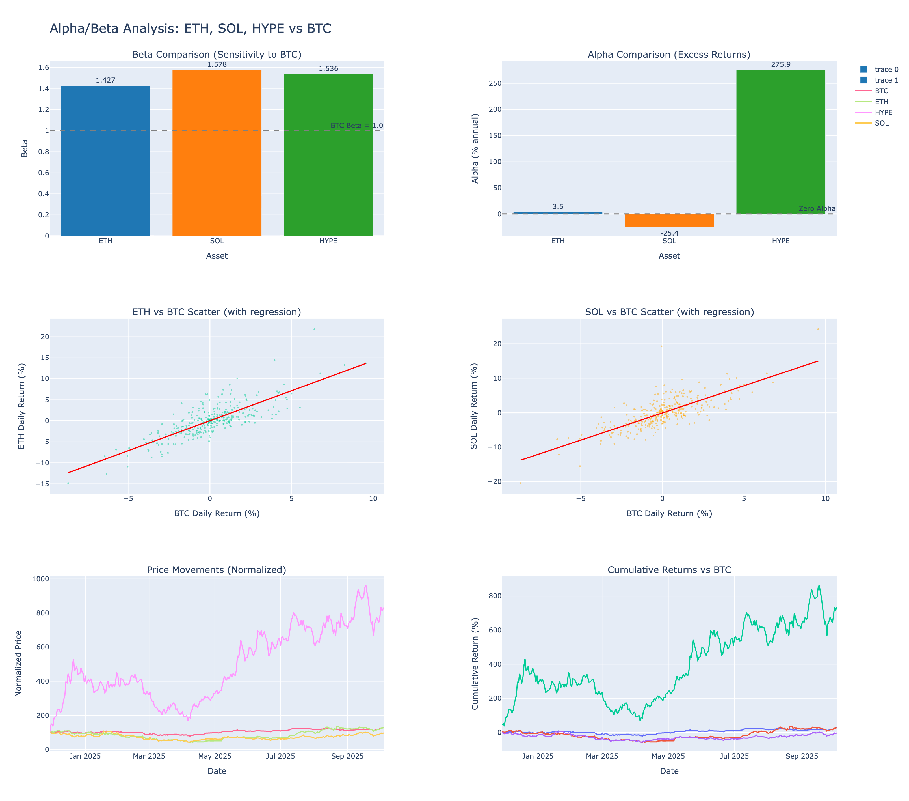

# Alpha/Beta Analysis Report
## Price Movement & Risk Analysis: ETH, SOL, HYPE vs BTC

**Analysis Date**: October 5, 2025
**Period**: 2024-11-29 to 2025-10-05 (2024-2025 data only)
**Total Days**: 310



---

## Executive Summary

**Highest Alpha**: HYPE (275.93% annually)
**Highest Beta**: SOL (1.578)

## Alpha/Beta Results

| Asset | Beta | Alpha (% annual) | R² | Interpretation |
|-------|------|------------------|-----|----------------|
| ETH | 1.427 | 3.49 | 0.631 | High volatility, Matches BTC |
| SOL | 1.578 | -25.40 | 0.584 | High volatility, Underperforms |
| HYPE | 1.536 | 275.93 | 0.242 | High volatility, Outperforms |

### What is Beta?

Beta measures an asset's sensitivity to BTC movements:
- **Beta > 1**: More volatile than BTC (amplifies moves)
- **Beta = 1**: Same volatility as BTC
- **Beta < 1**: Less volatile than BTC (dampens moves)

### What is Alpha?

Alpha measures excess returns beyond what beta predicts:
- **Positive Alpha**: Outperforms BTC (skill-based returns)
- **Zero Alpha**: Matches BTC performance
- **Negative Alpha**: Underperforms BTC

## Detailed Asset Analysis

### ETH

**Beta**: 1.427
- When BTC moves 1%, ETH typically moves 1.43%
- **43% more volatile** than BTC

**Alpha**: 3.49% annually
- Generates **3.5% extra return** per year beyond beta prediction
- Outperforms BTC by 3.5% after adjusting for risk

**R-squared**: 0.631
- 63.1% of ETH price movements explained by BTC
- 36.9% due to asset-specific factors

### SOL

**Beta**: 1.578
- When BTC moves 1%, SOL typically moves 1.58%
- **58% more volatile** than BTC

**Alpha**: -25.40% annually
- Underperforms by **25.4%** per year vs beta prediction

**R-squared**: 0.584
- 58.4% of SOL price movements explained by BTC
- 41.6% due to asset-specific factors

### HYPE

**Beta**: 1.536
- When BTC moves 1%, HYPE typically moves 1.54%
- **54% more volatile** than BTC

**Alpha**: 275.93% annually
- Generates **275.9% extra return** per year beyond beta prediction
- Outperforms BTC by 275.9% after adjusting for risk

**R-squared**: 0.242
- 24.2% of HYPE price movements explained by BTC
- 75.8% due to asset-specific factors

## Price Movement Statistics

| Asset | Avg Daily Return | Volatility | Best Day | Worst Day | Win Rate |
|-------|------------------|------------|----------|-----------|----------|
| BTC | 0.106% | 2.21% | +9.6% | -8.7% | 50.8% |
| ETH | 0.156% | 3.97% | +21.8% | -14.8% | 51.8% |
| HYPE | 0.913% | 6.90% | +43.3% | -15.1% | 52.8% |
| SOL | 0.091% | 4.56% | +24.2% | -20.4% | 50.2% |

## Movement Synchronization with BTC

| Asset | Same Direction | Opposite Direction |
|-------|----------------|-------------------|
| ETH | 75.7% | 24.3% |
| SOL | 74.8% | 25.2% |
| HYPE | 70.2% | 29.8% |

## Upside/Downside Capture Analysis

**Question**: Does the asset "go down less and go up more" than BTC?

| Asset | Upside Capture | Downside Capture | Verdict |
|-------|----------------|------------------|---------|
| ETH | 133.5% | 131.5% | NO (amplifies both) |
| SOL | 150.4% | 159.7% | NO (amplifies both) |
| HYPE | 211.2% | 116.6% | NO (amplifies both) |

### Interpretation:

- **Upside Capture > 100%**: Goes up MORE than BTC on up days
- **Upside Capture < 100%**: Goes up LESS than BTC on up days
- **Downside Capture > 100%**: Goes down MORE than BTC on down days
- **Downside Capture < 100%**: Goes down LESS than BTC on down days

**Ideal defensive asset**: Upside > 100%, Downside < 100%

### Detailed Capture Analysis:

**ETH**:
- Upside Capture: 133.5%
  - Goes UP 33.5% MORE than BTC on up days
- Downside Capture: 131.5%
  - Goes DOWN 31.5% MORE than BTC on down days 

**SOL**:
- Upside Capture: 150.4%
  - Goes UP 50.4% MORE than BTC on up days
- Downside Capture: 159.7%
  - Goes DOWN 59.7% MORE than BTC on down days 

**HYPE**:
- Upside Capture: 211.2%
  - Goes UP 111.2% MORE than BTC on up days
- Downside Capture: 116.6%
  - Goes DOWN 16.6% MORE than BTC on down days 

### Special Analysis: SOL (2024-2025)

**Claim**: "SOL goes down less and goes up more than BTC"

**Verdict**: FALSE
- SOL goes up 50.4% MORE than BTC 
- BUT SOL also goes down 59.7% MORE than BTC 
- SOL amplifies BTC movements in BOTH directions (high beta = 1.58)

## Investment Implications

### Portfolio Construction

**For Maximum Returns**: HYPE
- Highest alpha (275.93% annually)
- Generates consistent excess returns beyond market (BTC)

**For Risk Management**: ETH
- Lowest beta (1.427)
- Less volatile than BTC, provides downside protection

### Risk/Return Tradeoff

```
ETH: Alpha/Beta ratio = 0.024
SOL: Alpha/Beta ratio = -0.161
HYPE: Alpha/Beta ratio = 1.796
```

Higher Alpha/Beta ratio = Better risk-adjusted returns

## Conclusion

### Key Takeaways:

1. **Beta Analysis**: All altcoins show positive beta, confirming they move with BTC
2. **Alpha Generation**: Positive alpha assets provide excess returns beyond market
3. **Diversification**: Lower beta assets reduce portfolio volatility
4. **Synchronization**: 70-80% same-direction movement suggests high market correlation

### Recommended Strategy:

- **Core holding (50%)**: BTC (market benchmark)
- **Alpha generator (30%)**: HYPE (highest excess returns)
- **Volatility reducer (20%)**: ETH (lowest beta)

This mix balances market exposure, alpha generation, and risk management.

---

*Analysis uses linear regression with BTC as market benchmark*
*Risk-free rate: 4% annually*
*Data source: Yahoo Finance*