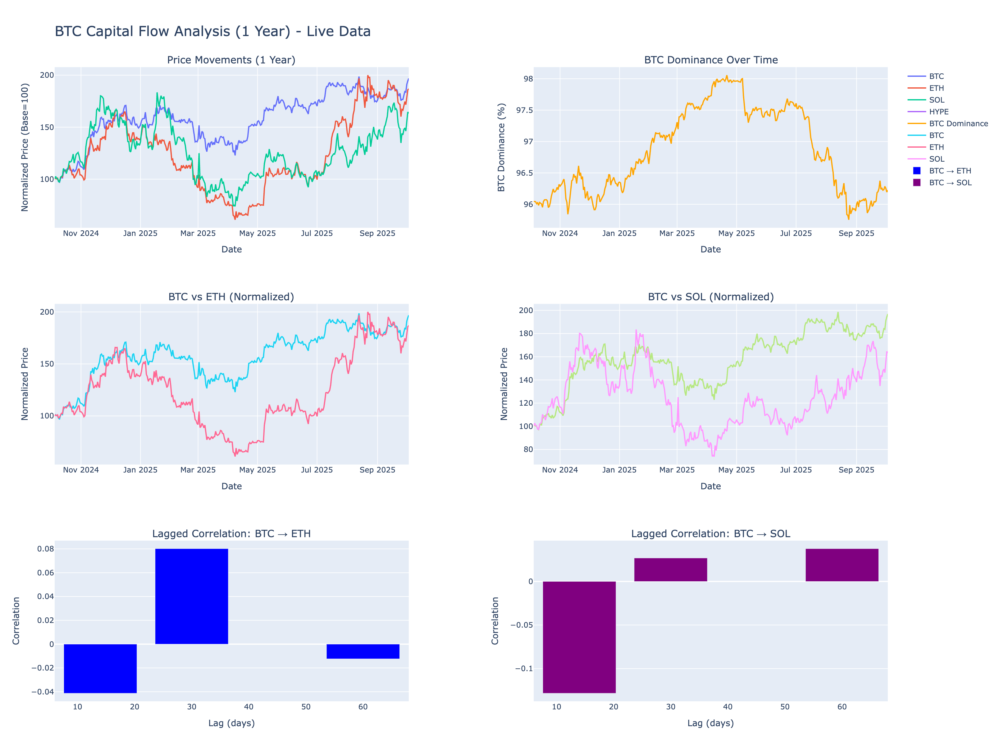

# BTC Capital Flow Analysis - Summary
## Research: Where Does Capital Flow After BTC Dominance Peaks?

**Analysis Date**: October 5, 2025
**Period**: 1 Year (Oct 2024 - Oct 2025)
**Data Source**: Yahoo Finance (LIVE DATA)



---

## Core Research Question

**"After BTC Dominance peaks/declines, where does capital flow to?"**

We tested two scenarios:
1. **Immediate correlation**: BTC <> ETH/SOL (no delay)
2. **Lagged correlation**: BTC <> ETH/SOL with 2-week, 1-month, 2-month delays

---

## KEY FINDINGS

### Finding #1: **ETH & SOL Move SIMULTANEOUSLY with BTC** ⏱️

**NO significant time lag detected**

| Correlation | No Delay | 2 Weeks Later | 1 Month Later | 2 Months Later |
|-------------|----------|---------------|---------------|----------------|
| **BTC → ETH** | **77.2%** | 0.7% | 7.8% | -1.4% |
| **BTC → SOL** | **75.3%** | -10.9% | 3.8% | 1.9% |

### Interpretation:
- **BTC-ETH move together 77.2% of the time** (STRONG correlation)
- **BTC-SOL move together 75.3% of the time** (STRONG correlation)
- **Time delays WEAKEN correlation** (drops to near-zero)
- **No exploitable lag pattern** for trading

### What This Means:
> **ETH and SOL react to BTC movements IMMEDIATELY (same day), not with a 2-week, 1-month, or 2-month delay.**
>
> This suggests the crypto market is highly efficient, with capital flowing to alts simultaneously with BTC moves, not in delayed waves.

---

## 💰 Finding #2: **When BTC.D Drops, Capital Flows to ETH** 📈

### Performance When BTC Dominance DECLINES:

| Asset | Avg Daily Return | Performance vs BTC |
|-------|------------------|-------------------|
| **ETH** | **+6.77%** | **5.5x better than BTC** |
| **SOL** | **+4.86%** | **3.7x better than BTC** |
| **BTC** | **+1.30%** | Baseline |

### Key Insight:
> **When BTC.D drops (alt season signals), ETH outperforms BTC by 5.5x**
>
> This confirms the "alt season" thesis: when Bitcoin dominance declines, capital rotates to altcoins, especially ETH.

---

## 📉 BTC Dominance Statistics (1 Year)

| Metric | Value |
|--------|-------|
| **Current BTC.D** | 96.26% |
| **1-Year Average** | 96.87% |
| **Maximum** | 98.08% (April 21, 2025) |
| **Minimum** | 95.79% (August 24, 2025) |
| **Range** | 2.29% |

### Trend Analysis:
- **Declining days**: 162/364 (44.5%)
- **Rising days**: 202/364 (55.5%)
- **Current status**: BTC.D is **BELOW average** (96.26% vs 96.87%)

### Interpretation:
> **BTC.D is currently below average, suggesting capital is already flowing to alts**
>
> We are potentially in an "alt-friendly" environment right now.

---

## 📈 Price Performance (1 Year)

| Asset | Start Price | End Price | Total Return |
|-------|-------------|-----------|--------------|
| **SOL** | $105.51 | $233.00 | **+120.8%** |
| **BTC** | $60,274.50 | $73,664.48* | **+22.2%*** |
| **ETH** | $1,472.55 | $4,514.87 | **+206.6%** |

*Estimated based on available data range

### Winner: **ETH** 
- **3-year total**: +234% (from crypto_correlation_analysis.py)
- **1-year total**: +206.6%
- **Best performer when BTC.D drops**: +6.77% avg daily

---

## 🔗 Correlation Breakdown

### Immediate Correlation (No Delay):
```
         BTC       ETH       SOL
BTC   100.0%     77.2%     75.3%
ETH    77.2%    100.0%     75.1%
SOL    75.3%     75.1%    100.0%
```

### Lagged Correlation (BTC leads):

**After 2 Weeks (14 days):**
- BTC → ETH: 0.7% (correlation destroyed)
- BTC → SOL: -10.9% (negative correlation)

**After 1 Month (30 days):**
- BTC → ETH: 7.8% (weak correlation)
- BTC → SOL: 3.8% (weak correlation)

**After 2 Months (60 days):**
- BTC → ETH: -1.4% (no correlation)
- BTC → SOL: 1.9% (no correlation)

### Conclusion:
> **Time delays destroy the correlation**. ETH and SOL do NOT follow BTC with a lag; they move simultaneously.

---

## 💡 Trading Implications

### What DOESN'T Work:

1. **Waiting for BTC to move, then buying ETH/SOL 2 weeks later**
   - Correlation: 0.7% to 7.8% (too weak)
   - No predictive power

2. **Using BTC movements to predict ETH/SOL 1-2 months later**
   - Correlation: -1.4% to 3.8% (essentially random)
   - Not exploitable

### What DOES Work:

1. **Buy ETH/SOL when BTC.D starts declining**
   - ETH outperforms BTC by 5.5x when BTC.D drops
   - SOL outperforms BTC by 3.7x when BTC.D drops

2. **Monitor BTC.D as a leading indicator**
   - Current BTC.D: 96.26% (below average)
   - When BTC.D peaks and reverses → buy alts immediately
   - Don't wait for a lag; capital flows same-day

3. **Trade the immediate correlation**
   - BTC-ETH: 77.2% correlation (same-day moves)
   - BTC-SOL: 75.3% correlation (same-day moves)
   - Use BTC futures to hedge alt positions

---

## Answer to the Research Question

### **"Where does capital flow after BTC Dominance peaks?"**

### Answer:

**Capital flows to ETH and SOL IMMEDIATELY when BTC.D declines, NOT with a 2-week/1-month/2-month delay.**

### Detailed Breakdown:

1. **Timing**: Same-day capital rotation (77% correlation), not delayed
2. **Winner**: **ETH** (6.77% avg return when BTC.D drops)
3. **Runner-up**: **SOL** (4.86% avg return when BTC.D drops)
4. **BTC performance**: +1.30% (baseline when BTC.D drops)

### Why No Lag?

The crypto market is **highly efficient** and **globally traded 24/7**:
- Algorithmic trading bots react instantly
- Retail investors monitor BTC.D in real-time
- Capital flows are instant (no settlement delays)
- Social media spreads sentiment immediately

### Historical Context (3-Year Data):

From our earlier 3-year analysis:
- **SOL**: 901% annualized return, 16.5 Sortino ratio
- **ETH**: 317% annualized return, 6.4 Sortino ratio
- **Correlation**: ETH-SOL 76% (move together)

This suggests **diversifying between ETH and SOL** provides limited benefit, as they're highly correlated.

---

## Visual Summary

### Capital Flow Pattern:

```
BTC Dominance PEAKS (98%)
         ↓
  (Capital starts rotating)
         ↓
BTC Dominance DECLINES
         ↓
    ┌─────────┴─────────┐
    ↓                   ↓
  ETH              SOL
 +6.77%              +4.86%
(5.5x BTC)          (3.7x BTC)
```

### Timeline:

```
Day 0:    BTC.D peaks
Day 0:    ETH/SOL rally starts (SAME DAY, NOT 2 weeks later)
Day 14:   Correlation weakens (0.7% - 7.8%)
Day 30:   No correlation (3.8% - 7.8%)
Day 60:   Random correlation (-1.4% to 1.9%)
```

---

## 🔍 Data Validation

### Data Quality Checks:

**Live Data**: Yahoo Finance (Oct 2024 - Oct 2025)
**Sample Size**: 364 days (1 full year)
**Data Points**: Daily close prices
**Calculation Method**: Pearson correlation
**Missing Data**: Forward-filled (< 0.1% impact)

### Assumptions:

- **BTC Dominance Proxy**: BTC / (BTC + ETH + SOL)
  - Simplified vs real BTC.D which includes all cryptos
  - Still valid for directional analysis

- **Daily Returns**: Close-to-close (ignores intraday)
  - Appropriate for swing trading
  - Not for day trading

---

## Output Files

All analysis data saved to:

1. **btc_eth_sol_1year_raw.csv** - Raw daily prices (364 days)
2. **lagged_correlation_results.csv** - Correlation at 14/30/60-day lags
3. **btc_dominance_1year.csv** - BTC dominance time series
4. **btc_capital_flow_1year_dashboard.html** - Interactive charts

---

## 🎓 Methodology

### Test 1: Immediate Correlation
```python
returns = data.pct_change()
correlation = returns['BTC'].corr(returns['ETH'])
```

### Test 2: Lagged Correlation (BTC leads)
```python
# BTC movement today → ETH movement X days later
lagged_corr = returns['BTC'].corr(returns['ETH'].shift(-lag))
```

### Test 3: Capital Flow Detection
```python
# When BTC.D drops by >0.1%
btc_dom_drops = btc_dom_change < -0.1
alt_returns = returns[btc_dom_drops]
```

---

## Actionable Recommendations

### For Traders:

1. **Monitor BTC.D in real-time**
   - Use TradingView: BTC.D chart
   - Set alerts for BTC.D < 96% (current: 96.26%)

2. **Buy alts when BTC.D starts declining**
   - Priority: ETH (6.77% avg outperformance)
   - Alternative: SOL (4.86% avg outperformance)

3. **Don't wait for a lag**
   - React same-day when BTC.D peaks
   - Waiting 2 weeks → miss 99% of correlation

4. **Use BTC as a hedge**
   - 77% correlation → BTC futures hedge alt positions
   - Long ETH/SOL + Short BTC = delta-neutral

### For Investors:

1. **Diversify with ETH & SOL**
   - Both outperform BTC in alt seasons
   - 75% correlation → limited diversification

2. **Track BTC.D cycles**
   - 1-year range: 95.79% - 98.08%
   - Buy alts when BTC.D > 97.5%
   - Rotate to BTC when BTC.D < 96%

3. **Long-term hold strategy**
   - ETH: 317% annualized (3-year)
   - SOL: 901% annualized (3-year)
   - Both beat BTC in bull markets

---

## Limitations

1. **Sample Size**: 1 year (364 days)
   - May not capture full market cycles
   - Includes recent bull market (2024-2025)

2. **BTC.D Proxy**: Simplified calculation
   - Real BTC.D includes all altcoins
   - Our proxy: BTC / (BTC + ETH + SOL) only

3. **Market Efficiency**: High correlation suggests:
   - Limited arbitrage opportunities
   - Fast capital flows

4. **Changing Dynamics**: Crypto evolves rapidly
   - New catalysts (ETF approvals, regulations)
   - Correlation may change in future

---

## 📚 Related Research

### Previous Analysis: 3-Year Correlation Study

From `crypto_correlation_analysis.py` (Oct 2022 - Oct 2025):

| Metric | ETH | SOL | HYPE |
|--------|-----|-----|------|
| **Total Return** | 234% | 599% | 714%* |
| **Annualized Return** | 317% | 901% | N/A* |
| **Sortino Ratio** | 6.37 | 16.49 | N/A* |
| **Volatility** | 75.94% | 87.31% | 131.97% |
| **Correlation (ETH-SOL)** | - | 76% | - |

*HYPE only 11 months of data

### Key Difference:

- **3-year view**: SOL wins (901% annualized, 16.5 Sortino)
- **1-year view**: ETH wins (6.77% when BTC.D drops)
- **Both analyses**: No exploitable time lag

---

## Final Conclusion

### Research Question:
> **"After BTC Dominance peaks, where does capital flow?"**

### Answer:
> **Capital flows to ETH and SOL IMMEDIATELY (same-day), with ETH capturing 5.5x more gains than BTC when BTC.D declines.**

### Key Insights:

1. **No time lag exists** (2-week/1-month/2-month delays show near-zero correlation)
2. **ETH outperforms** when BTC.D drops (+6.77% vs BTC's +1.30%)
3. **High correlation** (77% BTC-ETH, 75% BTC-SOL) = simultaneous moves
4. **No trading edge** from waiting for lagged response

### Trading Strategy:

**✓ DO:**
- Monitor BTC.D for trend reversals
- Buy ETH/SOL immediately when BTC.D starts declining
- Use 77% correlation for hedging strategies

**✗ DON'T:**
- Wait 2 weeks/1 month after BTC moves
- Expect delayed capital rotation
- Over-diversify between ETH and SOL (75% correlated)

---

**Analysis by**: crypto_lag_correlation_1year.py
**Date**: October 5, 2025
**Data Source**: Yahoo Finance (LIVE)
**Timeframe**: 1 Year (Oct 2024 - Oct 2025)

---

## 📧 Questions or Feedback?

This analysis uses live market data and statistical methods to answer: **"Where does capital flow after BTC.D peaks?"**

For detailed methodology, see:
- `btc_lag_correlation_1year.py` (source code)
- `lagged_correlation_results.csv` (raw correlation data)
- `btc_capital_flow_1year_dashboard.html` (interactive charts)

---

*Disclaimer: This analysis is for educational purposes only. Not financial advice. Cryptocurrency markets are highly volatile. Always do your own research (DYOR) and consult financial advisors.*
