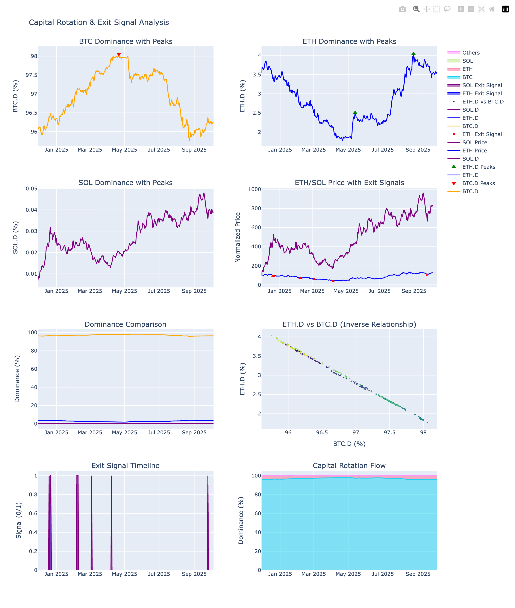

# Capital Rotation Exit Signal Analysis
## When to Exit ETH/SOL: Detecting Rotation to Smaller Caps

**Analysis Date**: October 05, 2025
**Period**: 2024-11-29 to 2025-10-05
**Total Days**: 310



---

## Research Question

**"After BTC.D drops and capital flows to ETH/SOL, how long does it stay before rotating to smaller caps?"**

This analysis identifies:**exit signals** for ETH/SOL positions by detecting when capital rotates down the risk curve to smaller cap altcoins.

---

## Key Findings

### Rotation Timing

- **Average time from BTC.D peak to ETH.D peak**: 22.0 days
- **Median time**: 22.0 days
- **Average ETH return during rotation**: 69.66%

### Interpretation:

> After BTC dominance peaks, it takes approximately **22 days** for ETH dominance to peak.
> 
> **Exit signal**: When ETH.D starts declining from its peak, capital is rotating to smaller caps.

---

## 🚨 Current Status

**Current Dominance** (as of 2025-10-05):

- **BTC.D**: 96.27% (+0.01% last 7 days)
- **ETH.D**: 3.51% (-0.01% last 7 days)
- **SOL.D**: 0.04% (-0.00% last 7 days)

**Exit Signals:**

- **ETH Exit Signal: INACTIVE**
  - ETH.D is stable or rising
  - Safe to hold ETH positions

- **SOL Exit Signal: INACTIVE**
  - SOL.D is stable or rising
  - Safe to hold SOL positions

---

## 📐 Methodology

### Dominance Calculation

```
BTC.D = BTC / (BTC + ETH + SOL + Others) × 100%
ETH.D = ETH / (BTC + ETH + SOL + Others) × 100%
SOL.D = SOL / (BTC + ETH + SOL + Others) × 100%
```

### Exit Signal Rules

**ETH Exit Signal** triggers when:
1. ETH.D declines by >0.3% over 7 days, OR
2. BTC.D rises by >0.3% over 7 days

**SOL Exit Signal** triggers when:
1. SOL.D declines by >0.2% over 7 days, OR
2. BTC.D rises by >0.3% over 7 days

### Peak Detection

- Uses scipy.signal.find_peaks with prominence thresholds
- BTC.D peaks: minimum prominence 0.5%
- ETH.D peaks: minimum prominence 0.3%
- SOL.D peaks: minimum prominence 0.2%
- Minimum distance between peaks: 14 days

---

## 💡 Trading Strategy

### Entry (from BTC Capital Flow Analysis)

1. **Monitor BTC.D** for peaks and reversals
2. **Buy ETH/SOL immediately** when BTC.D starts declining
3. Capital flows to majors **same-day** (not with 2-week lag)

### Exit (from this analysis)

1. **Monitor ETH.D and SOL.D** after entering positions
2. **Exit when ETH.D/SOL.D peak and start declining**
3. Signals capital rotating to smaller caps or back to BTC
4. **Typical hold duration**: ~22 days after BTC.D peak

### Risk Management

- **Stop loss**: If BTC.D reverses and starts rising sharply
- **Take profit**: When ETH.D/SOL.D decline for 3+ consecutive days
- **Position sizing**: Reduce exposure as exit signals activate

---

## Limitations

1. **Simplified dominance**: Only includes BTC, ETH, SOL, HYPE (missing many alts)
2. **Market conditions**: Analysis based on recent market cycle
3. **False signals**: May trigger during short-term volatility
4. **Not financial advice**: Use with other indicators and risk management

---

## Output Files

1. **CAPITAL_ROTATION_EXIT_SIGNALS.md** - This report
2. **capital_rotation_exit_signals_dashboard.html** - Interactive charts
3. **images/capital_rotation_exit_signals_dashboard.png** - Dashboard screenshot
4. **dominance_data.csv** - Dominance time series
5. **exit_signals.csv** - Exit signal timeline
6. **rotation_events.csv** - Historical rotation events

---

*Analysis by: capital_rotation_exit_signals.py*
*Data source: Yahoo Finance*
*Generated: 2025-10-05 13:38:40*