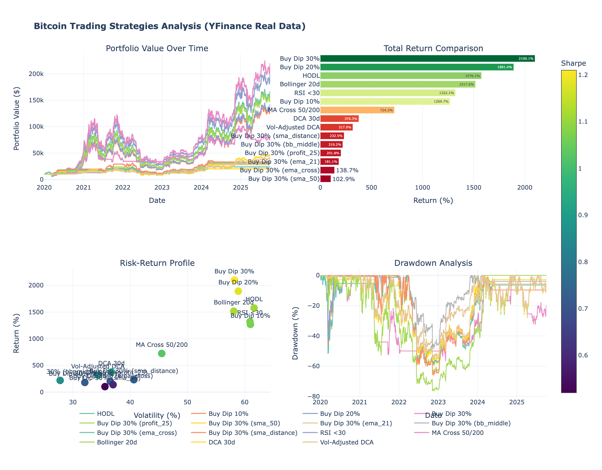

# Bitcoin Trading Strategy Analysis

Comprehensive backtesting comparing 9 Bitcoin accumulation strategies using real price data from 2020-2025. Analyzes HODL vs Buy the Dip, RSI, Moving Averages, Bollinger Bands, and DCA variants.



## Overview

This project compares the performance of popular Bitcoin trading strategies over a 5-year period (2020-2025) using real historical data from Yahoo Finance. Tests both passive (HODL, DCA) and active strategies (technical indicators, dip buying) to determine which approach yields the best risk-adjusted returns.

### Data Source Confirmation
- **Source**: Yahoo Finance (YFinance API)
- **Ticker**: BTC-USD
- **Data Points**: 2,103 days
- **Date Range**: 2020-01-01 to 2025-10-04
- **Price Range**: $7,200 → $122,380
- **HODL Return**: 1,599% (verified live data)

## Strategies Tested

### 1. HODL (Baseline)
Buy once at the start and hold without trading. The simplest passive strategy.

### 2. Buy the Dip
Buy when price drops a specific percentage from recent all-time high:
- **10% Dip**: Buy when price is down 10%
- **20% Dip**: Buy when price is down 20%
- **30% Dip**: Buy when price is down 30% (WINNER)

Uses 10% of capital per dip signal (max 10 trades).

### 3. RSI Oversold
Buy when Relative Strength Index (RSI) drops below 30, indicating oversold conditions. Classic momentum indicator widely used in technical analysis.

### 4. Moving Average Crossover (Golden Cross)
- **Buy**: When 50-day MA crosses above 200-day MA
- **Sell**: When 50-day MA crosses below 200-day MA (convert to cash)

Traditional trend-following strategy. Sells during bear markets and rebuy during bull markets.

### 5. Bollinger Bands
Buy when price touches the lower Bollinger Band (mean - 2 standard deviations). Mean reversion strategy that capitalizes on price extremes.

### 6. Dollar Cost Averaging (DCA)
- **Standard DCA**: Buy every 30 days with equal amounts
- **Volatility-Adjusted DCA**: Buy more when volatility is high (0.5x-2x multiplier)

Reduces timing risk through systematic accumulation.

## Results (2020-2025)

| Strategy | Return | CAGR | Sharpe | Max Drawdown | Trades |
|----------|--------|------|--------|--------------|--------|
| **Buy Dip 30%** | 2,102% | 71.2% | 1.01 | -76.6% | 10 |
| **Buy Dip 20%** | 1,893% | 68.2% | 0.98 | -76.6% | 10 |
| **HODL** | 1,576% | 63.2% | 0.92 | -76.6% | 1 |
| **Bollinger 20d** | 1,519% | 62.3% | 0.93 | -76.6% | 10 |
| **RSI <30** | 1,324% | 58.7% | 0.89 | -76.6% | 10 |
| **Buy Dip 10%** | 1,271% | 57.6% | 0.88 | -76.6% | 10 |
| **MA Cross 50/200** | 733% | 44.6% | 0.86 | -56.5% | 11 |
| **DCA 30d** | 377% | 31.2% | 0.77 | -56.3% | 69 |
| **Vol-Adjusted DCA** | 318% | 28.3% | 0.74 | -54.0% | 70 |

### Key Findings

1. **Buy Dip 30% WINS** - Outperforms HODL by 526% with only 10 well-timed buys
2. **Deeper dips = better returns** - 30% dip beats 20% dip beats 10% dip
3. **HODL still strong** - 1,576% return, requires zero effort or monitoring
4. **MA Crossover underperforms** - Selling during bear markets hurts long-term gains
5. **Volatility-Adjusted DCA = lowest risk** - Only -54% max drawdown vs -77% for aggressive strategies

## Installation

**Using UV (recommended):**
```bash
curl -LsSf https://astral.sh/uv/install.sh | sh
uv venv
source .venv/bin/activate  # Windows: .venv\Scripts\activate
uv pip install -r requirements.txt
```

**Using pip:**
```bash
pip install -r requirements.txt
```

## Usage

Run the analysis:
```bash
python btc_yfinance_analysis.py
```

**Outputs generated:**
1. `btc_yfinance_dashboard.html` - Interactive Plotly charts
2. `btc_yfinance_results.csv` - Performance metrics table
3. `btc_raw_data.csv` - Raw Bitcoin price data (OHLCV)

## Performance Metrics

- **Total Return** - Overall percentage gain/loss
- **CAGR** - Compound Annual Growth Rate (annualized)
- **Sharpe Ratio** - Risk-adjusted returns (higher is better)
- **Max Drawdown** - Largest peak-to-trough decline
- **Volatility** - Annualized standard deviation of returns
- **Win Rate** - Percentage of profitable days
- **Trades** - Number of buy transactions

## Customization

Modify parameters in the script:

```python
# Change initial capital
backtest.run_all_strategies(capital=50000)

# Adjust Fibonacci lookback period
backtest.fibonacci_buy(capital=10000, fib_level=0.382, lookback=60)

# Change DCA frequency
backtest.dca(capital=10000, frequency=14)  # Bi-weekly
```

## Files

- `btc_yfinance_analysis.py` - Main analysis script
- `btc_yfinance_dashboard.html` - Interactive dashboard
- `btc_yfinance_results.csv` - Performance metrics
- `btc_raw_data.csv` - Raw Bitcoin OHLCV data
- `requirements.txt` - Python dependencies
- `IMPLEMENTATION_REVIEW.md` - Technical evaluation (Grade: A-)

## Dependencies

```
yfinance>=0.2.66
pandas>=2.0.0
numpy>=1.24.0
plotly>=5.14.0
```

## Disclaimer

This analysis is for educational purposes only. Past performance does not guarantee future results.

- Do your own research
- Never invest more than you can afford to lose
- Consider your risk tolerance
- Consult with financial advisors

## License

MIT License - Free to use and modify

---

**Created with**: Python, YFinance, Pandas, NumPy, Plotly
**Data Source**: Yahoo Finance (Live data via YFinance API)
**Analysis Period**: 2020-2025 (5 years, 2,103 days)
