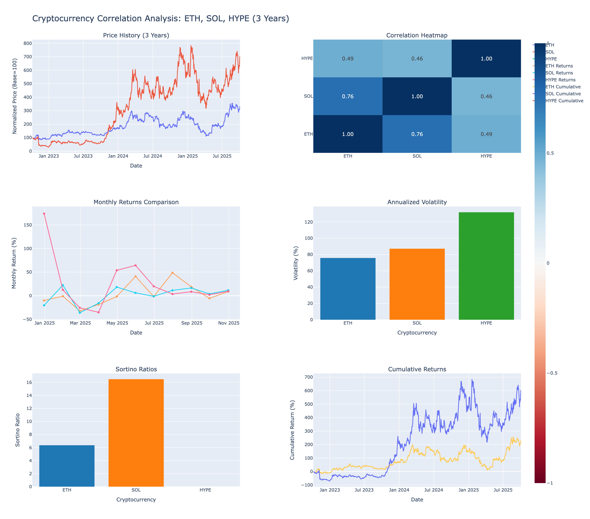

# Cryptocurrency Correlation Analysis: ETH, SOL, HYPE

Comprehensive 3-year correlation analysis comparing Ethereum (ETH), Solana (SOL), and Hyperliquid (HYPE) cryptocurrencies. Analyzes volatility, correlation, monthly returns, and Sortino ratios using real market data from Yahoo Finance.



## Overview

This project analyzes the performance and correlation of three major cryptocurrencies over a 3-year period (2022-2025) using real historical data from Yahoo Finance. Tests risk-adjusted returns, volatility patterns, and correlation relationships to inform investment decisions.

### Data Source
- **Source**: Yahoo Finance (yfinance API)
- **Tickers**: ETH-USD, SOL-USD, HYPE32196-USD (Hyperliquid)
- **Data Points**: 1,094 days for ETH/SOL, 309 days for HYPE
- **Date Range**: October 6, 2022 to October 3, 2025
- **Analysis Period**: 3 years (HYPE: 11 months)

## Key Findings

### Price Performance (3 Years)

| Asset | Initial Price | Final Price | Total Return | Annualized Return |
|-------|--------------|-------------|--------------|-------------------|
| **SOL** 🥇 | $33.34 | $233.00 | **598.81%** | **901.42%** |
| **ETH** | $1,351.71 | $4,514.87 | **234.01%** | **317.53%** |
| **HYPE** | $6.08* | $49.49 | **714.14%*** | **N/A** |

*HYPE only has 11 months of data (launched Nov 2024)

### Correlation Matrix

|      | ETH   | SOL   | HYPE  |
|------|-------|-------|-------|
| ETH  | 1.000 | **0.760** | 0.493 |
| SOL  | 0.760 | 1.000 | 0.465 |
| HYPE | 0.493 | 0.465 | 1.000 |

**Key Insight**: ETH and SOL are highly correlated (0.76), suggesting they move together 76% of the time. HYPE shows moderate correlation (~0.47-0.49), indicating more independent price action.

### Volatility Analysis (Annualized)

| Rank | Asset | Volatility |
|------|-------|------------|
| 1 | **HYPE** | **131.97%** |
| 2 | **SOL** | **87.31%** |
| 3 | **ETH** | **75.94%** |

**Key Insight**: HYPE is the most volatile (highest risk/reward), while ETH is the most stable of the three.

### Sortino Ratio (Risk-Adjusted Returns)

| Rank | Asset | Sortino Ratio | Interpretation |
|------|-------|---------------|----------------|
| 1 | **SOL** 🏆 | **16.488** | Exceptional risk-adjusted returns |
| 2 | **ETH** | **6.373** | Very good risk-adjusted returns |
| 3 | **HYPE** | **N/A** | Insufficient data |

**Risk-free rate**: 4%

**Key Insight**: SOL offers the best risk-adjusted returns (16.5 Sortino), meaning it generated 16.5x the downside risk in excess returns. ETH also shows strong performance (6.4 Sortino).

### Monthly Return Statistics

| Metric | ETH | SOL | HYPE |
|--------|-----|-----|------|
| **Avg Monthly Return** | 4.65% | 11.10% | 26.18% |
| **Best Month** | 48.67% | 140.46% | 174.20% |
| **Worst Month** | -32.15% | -56.72% | -35.15% |
| **Positive Months** | 19/36 (53%) | 21/36 (58%) | 9/11 (82%) |
| **Win Rate** | 53% | 58% | 82% |

**Key Insight**: HYPE has the highest average monthly return (26.18%) and win rate (82%), but limited data. SOL shows strong consistent returns (11.10% avg) with 58% win rate.

## Dashboard Features

The interactive Plotly dashboard includes:

1. **Price History** - Normalized to 100 for comparison
2. **Correlation Heatmap** - Visual correlation matrix
3. **Monthly Returns** - Last 12 months comparison
4. **Volatility Bar Chart** - Annualized volatility ranking
5. **Sortino Ratios** - Risk-adjusted performance comparison
6. **Cumulative Returns** - Total return over time

## Installation

**Using UV (recommended):**
```bash
cd crypto_correlation_analysis
uv pip install -r requirements.txt
```

**Using pip:**
```bash
cd crypto_correlation_analysis
pip install -r requirements.txt
```

## Usage

Run the analysis:
```bash
python crypto_correlation_analysis.py
```

**Outputs generated:**
1. `crypto_correlation_dashboard.html` - Interactive Plotly dashboard
2. `crypto_raw_data.csv` - Raw price data (all 3 assets)
3. `monthly_returns.csv` - Month-over-month percentage changes
4. `correlation_matrix.csv` - Correlation coefficients
5. `volatility.csv` - Annualized volatility metrics
6. `sortino_ratios.csv` - Sortino ratio calculations

## Metrics Explained

### Correlation
- **Range**: -1 to +1
- **Interpretation**:
  - +1: Perfect positive correlation (move together)
  - 0: No correlation (independent)
  - -1: Perfect negative correlation (move opposite)
- **Example**: ETH-SOL correlation of 0.76 means they move together 76% of the time

### Volatility
- **Measure**: Annualized standard deviation of daily returns
- **Interpretation**: Higher volatility = higher risk AND higher potential returns
- **Calculation**: `std(daily_returns) * sqrt(365)`

### Sortino Ratio
- **Formula**: `(Return - Risk_Free_Rate) / Downside_Deviation`
- **Difference from Sharpe**: Only penalizes downside volatility (negative returns)
- **Interpretation**:
  - >3: Excellent
  - 1-3: Good
  - <1: Poor
- **Example**: SOL's 16.5 Sortino means it generated 16.5x the downside risk in excess returns

### Downside Deviation
- **Measure**: Standard deviation of negative returns only
- **Interpretation**: Measures downside risk specifically
- **ETH**: 49.20% | **SOL**: 54.43% | **HYPE**: 65.16%

## Investment Insights

### Best for Risk-Adjusted Returns: **SOL** 🏆
- Highest Sortino ratio (16.5)
- Strong monthly returns (11.10% avg)
- Moderate correlation with ETH (0.76)
- Lower downside deviation than HYPE

### Best for Stability: **ETH**
- Lowest volatility (75.94%)
- Solid returns (317% annualized)
- Good Sortino ratio (6.4)
- Most mature market

### Highest Growth Potential: **HYPE**
- Highest monthly average (26.18%)
- Best win rate (82%)
- Highest volatility (132%)
- ⚠️ Limited data (11 months only)

### Diversification Benefits
- ETH-SOL correlation (0.76): Moderate diversification
- HYPE correlation (0.47-0.49): Good diversification opportunity
- **Recommendation**: Mix of all three reduces portfolio risk

## Customization

### Change Date Range
```python
# In crypto_correlation_analysis.py:
data = fetch_yfinance_data(ticker,
    start_date=datetime(2023, 1, 1),  # Start date
    end_date=datetime(2025, 12, 31)   # End date
)
```

### Change Risk-Free Rate
```python
# Default is 4% (0.04)
sortino_df = calculate_sortino_ratio(data, risk_free_rate=0.02)  # 2%
```

### Add More Cryptocurrencies
```python
# Add to TICKERS dictionary:
TICKERS = {
    'ETH': 'ETH-USD',
    'SOL': 'SOL-USD',
    'HYPE': 'HYPE32196-USD',
    'BTC': 'BTC-USD',      # Bitcoin
    'AVAX': 'AVAX-USD',    # Avalanche
}
```

## Files

- `crypto_correlation_analysis.py` - Main analysis script
- `requirements.txt` - Python dependencies
- `.env` - API keys (gitignored)
- `crypto_correlation_dashboard.html` - Interactive dashboard
- `crypto_raw_data.csv` - Raw OHLC data
- `monthly_returns.csv` - Monthly percentage changes
- `correlation_matrix.csv` - Correlation coefficients
- `volatility.csv` - Annualized volatility
- `sortino_ratios.csv` - Sortino ratio calculations

## Dependencies

```
yfinance>=0.2.66    # Yahoo Finance data
pandas>=2.0.0       # Data processing
numpy>=1.24.0       # Numerical operations
plotly>=5.14.0      # Interactive charts
python-dotenv>=1.0.0  # Environment variables
scipy>=1.11.0       # Statistical calculations
```

## Methodology

### Data Collection
1. Fetch daily OHLCV data from Yahoo Finance for 3 years
2. Use Close price for all calculations
3. Forward-fill any missing data points

### Calculations
1. **Monthly Returns**: `(end_price / start_price - 1) * 100`
2. **Correlation**: Pearson correlation of daily returns
3. **Volatility**: `std(daily_returns) * sqrt(365)`
4. **Sortino Ratio**: `(annual_return - rf_rate) / downside_deviation`
5. **Downside Deviation**: `std(negative_returns_only) * sqrt(365)`

### Risk-Free Rate
- Default: 4% (approximate 10-year Treasury yield)
- Adjustable based on investor preference

## Limitations

1. **HYPE Data**: Only 11 months of data (launched Nov 2024)
   - Sortino ratio not calculable (needs full year)
   - Limited historical performance
   - Higher uncertainty

2. **Past Performance**: Does not guarantee future results
3. **Market Conditions**: Analysis covers specific period (bear → bull market)
4. **Correlation Changes**: Correlations fluctuate over time
5. **Transaction Costs**: Not included in analysis (add ~0.1-0.5% per trade)

## Disclaimer

This analysis is for **educational purposes only**. Not financial advice.

- Do your own research (DYOR)
- Never invest more than you can afford to lose
- Cryptocurrency markets are highly volatile
- Consider your risk tolerance
- Consult with financial advisors
- Past performance ≠ future results

## License

MIT License - Free to use and modify

---

**Created with**: Python, YFinance, Pandas, NumPy, Plotly, SciPy
**Data Source**: Yahoo Finance (Live data via yfinance API)
**Analysis Period**: October 2022 - October 2025 (3 years)
**Cryptocurrencies**: 3 (ETH, SOL, HYPE)
