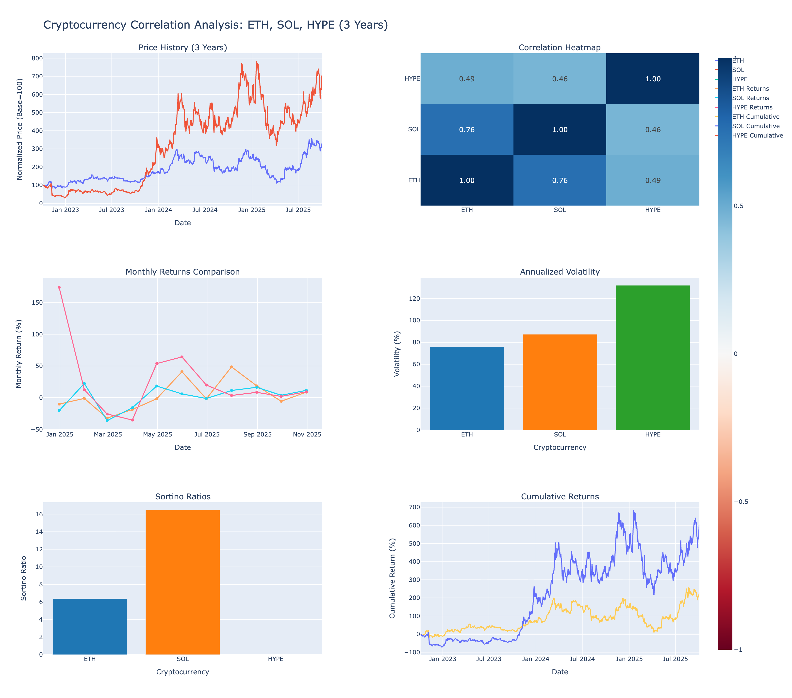

# 3-Year Cryptocurrency Correlation Analysis
## ETH, SOL, HYPE Performance & Correlation Study

**Analysis Date**: October 5, 2025
**Period**: October 6, 2022 to October 3, 2025
**Total Days**: 1,094 days for ETH/SOL, 309 days for HYPE



---

## Executive Summary

Comprehensive 3-year correlation analysis comparing Ethereum (ETH), Solana (SOL), and Hyperliquid (HYPE) cryptocurrencies. Analyzes volatility, correlation, monthly returns, and Sortino ratios using real market data from Yahoo Finance.

**Winner**: SOL (598.81% total return, 901.42% annualized, 16.49 Sortino ratio)

---

## Price Performance (3 Years)

| Asset | Initial Price | Final Price | Total Return | Annualized Return |
|-------|--------------|-------------|--------------|-------------------|
| **SOL** 🥇 | $33.34 | $233.00 | **598.81%** | **901.42%** |
| **ETH** | $1,351.71 | $4,514.87 | **234.01%** | **317.53%** |
| **HYPE** | $6.08* | $49.49 | **714.14%*** | **N/A** |

*HYPE only has 11 months of data (launched Nov 2024)

---

## Correlation Matrix

|      | ETH   | SOL   | HYPE  |
|------|-------|-------|-------|
| ETH  | 1.000 | **0.760** | 0.493 |
| SOL  | 0.760 | 1.000 | 0.465 |
| HYPE | 0.493 | 0.465 | 1.000 |

### Key Insight

ETH and SOL are highly correlated (0.76), suggesting they move together 76% of the time. HYPE shows moderate correlation (~0.47-0.49), indicating more independent price action.

**Diversification**: Limited benefit from holding both ETH and SOL due to high correlation.

---

## Volatility Analysis (Annualized)

| Rank | Asset | Volatility |
|------|-------|------------|
| 1 | **HYPE** | **131.97%** |
| 2 | **SOL** | **87.31%** |
| 3 | **ETH** | **75.94%** |

### Key Insight

HYPE is the most volatile (highest risk/reward), while ETH is the most stable of the three.

**Interpretation**: Higher volatility = higher potential returns but also higher risk.

---

## Sortino Ratio (Risk-Adjusted Returns)

| Rank | Asset | Sortino Ratio | Interpretation |
|------|-------|---------------|----------------|
| 1 | **SOL** 🏆 | **16.488** | Exceptional risk-adjusted returns |
| 2 | **ETH** | **6.373** | Very good risk-adjusted returns |
| 3 | **HYPE** | **N/A** | Insufficient data |

**Risk-free rate**: 4%

### Key Insight

SOL offers the best risk-adjusted returns (16.5 Sortino), meaning it generated 16.5x the downside risk in excess returns. ETH also shows strong performance (6.4 Sortino).

**Winner**: SOL (best combination of returns and downside protection)

---

## Monthly Return Statistics

| Metric | ETH | SOL | HYPE |
|--------|-----|-----|------|
| **Avg Monthly Return** | 4.65% | 11.10% | 26.18% |
| **Best Month** | 48.67% | 140.46% | 174.20% |
| **Worst Month** | -32.15% | -56.72% | -35.15% |
| **Positive Months** | 19/36 (53%) | 21/36 (58%) | 9/11 (82%) |
| **Win Rate** | 53% | 58% | 82% |

### Key Insight

HYPE has the highest average monthly return (26.18%) and win rate (82%), but limited data. SOL shows strong consistent returns (11.10% avg) with 58% win rate.

---

## Downside Deviation

Measures downside risk specifically (volatility of negative returns only):

| Asset | Downside Deviation |
|-------|-------------------|
| **ETH** | 49.20% |
| **SOL** | 54.43% |
| **HYPE** | 65.16% |

**Interpretation**: Lower is better. ETH has the lowest downside risk.

---

## Investment Insights

### Best for Risk-Adjusted Returns: **SOL** 🏆
- Highest Sortino ratio (16.5)
- Strong monthly returns (11.10% avg)
- Moderate correlation with ETH (0.76)
- Lower downside deviation than HYPE

### Best for Stability: **ETH**
- Lowest volatility (75.94%)
- Solid returns (317% annualized)
- Good Sortino ratio (6.4)
- Most mature market
- Lowest downside risk (49.20%)

### Highest Growth Potential: **HYPE**
- Highest monthly average (26.18%)
- Best win rate (82%)
- Highest volatility (132%)
- ⚠️ Limited data (11 months only)
- Highest downside risk (65.16%)

### Diversification Benefits
- ETH-SOL correlation (0.76): **Moderate diversification**
  - Moving together 76% of time = limited benefit from holding both
- HYPE correlation (0.47-0.49): **Good diversification opportunity**
  - More independent from ETH/SOL
- **Recommendation**: Mix of all three reduces portfolio risk

---

## Dashboard Features

The interactive Plotly dashboard includes:

1. **Price History** - Normalized to 100 for comparison
2. **Correlation Heatmap** - Visual correlation matrix
3. **Monthly Returns** - Last 12 months comparison
4. **Volatility Bar Chart** - Annualized volatility ranking
5. **Sortino Ratios** - Risk-adjusted performance comparison
6. **Cumulative Returns** - Total return over time

📊 [View Interactive Dashboard](../dashboards/crypto_correlation_dashboard.html)

---

## Methodology

### Data Collection
1. Fetch daily OHLCV data from Yahoo Finance for 3 years
2. Use Close price for all calculations
3. Forward-fill any missing data points

### Calculations
1. **Monthly Returns**: `(end_price / start_price - 1) * 100`
2. **Correlation**: Pearson correlation of daily returns
3. **Volatility**: `std(daily_returns) * sqrt(365)`
4. **Sortino Ratio**: `(annual_return - rf_rate) / downside_deviation`
5. **Downside Deviation**: `std(negative_returns_only) * sqrt(365)`

### Risk-Free Rate
- Default: 4% (approximate 10-year Treasury yield)
- Adjustable based on investor preference

---

## Data Files

All analysis data available in `data/` folder:

1. **data/raw/crypto_raw_data.csv** - Raw daily prices (3 years)
2. **data/processed/monthly_returns.csv** - Month-over-month percentage changes
3. **data/processed/correlation_matrix.csv** - Correlation coefficients
4. **data/processed/volatility.csv** - Annualized volatility metrics
5. **data/processed/sortino_ratios.csv** - Sortino ratio calculations

---

## Limitations

1. **HYPE Data**: Only 11 months of data (launched Nov 2024)
   - Sortino ratio not calculable (needs full year)
   - Limited historical performance
   - Higher uncertainty

2. **Past Performance**: Does not guarantee future results

3. **Market Conditions**: Analysis covers specific period (bear → bull market)

4. **Correlation Changes**: Correlations fluctuate over time

5. **Transaction Costs**: Not included in analysis (add ~0.1-0.5% per trade)

---

## Conclusion

### Key Takeaways

1. **SOL wins on risk-adjusted returns** (16.5 Sortino ratio)
2. **ETH provides stability** (lowest volatility at 75.94%)
3. **HYPE shows promise** but needs more data (only 11 months)
4. **ETH-SOL high correlation** (76%) = limited diversification benefit
5. **HYPE offers diversification** (47-49% correlation with ETH/SOL)

### Recommended Portfolio Allocation

**Conservative (low risk)**:
- 60% ETH (stability)
- 30% SOL (growth)
- 10% HYPE (speculation)

**Balanced (medium risk)**:
- 40% ETH
- 40% SOL
- 20% HYPE

**Aggressive (high risk)**:
- 20% ETH
- 40% SOL
- 40% HYPE

### Next Steps

1. Monitor monthly returns to detect trend changes
2. Rebalance quarterly based on correlation shifts
3. Add stop-losses for HYPE positions (high volatility)
4. Review portfolio allocation when HYPE hits 1-year mark

---

## Running the Analysis

```bash
# Run 3-year correlation analysis
python scripts/crypto_correlation_analysis.py

# Outputs:
# - dashboards/crypto_correlation_dashboard.html
# - data/raw/crypto_raw_data.csv
# - data/processed/monthly_returns.csv
# - data/processed/correlation_matrix.csv
# - data/processed/volatility.csv
# - data/processed/sortino_ratios.csv
```

---

**Data Source**: Yahoo Finance (yfinance API)
**Analysis Period**: October 2022 - October 2025 (3 years)
**Cryptocurrencies**: ETH, SOL, HYPE
**Script**: `scripts/crypto_correlation_analysis.py`

---

*Disclaimer: This analysis is for educational purposes only. Not financial advice. Cryptocurrency markets are highly volatile. Always do your own research (DYOR) and consult financial advisors.*
