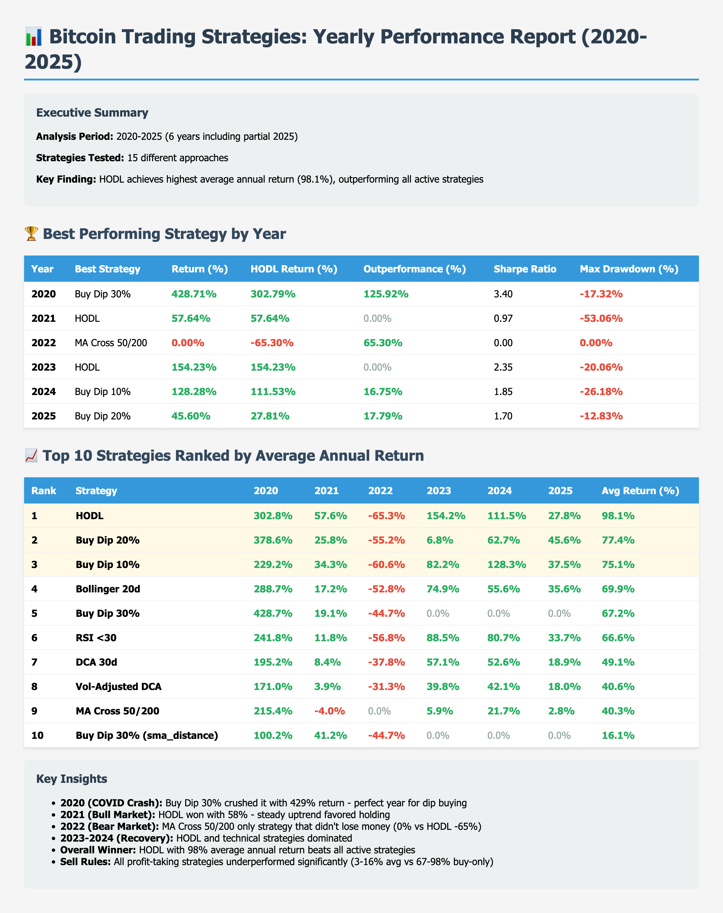
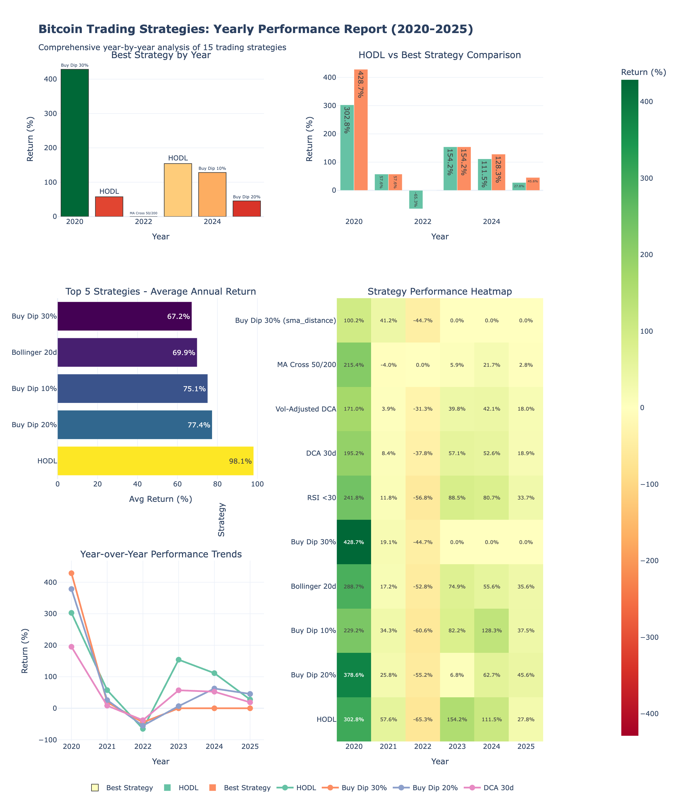

# Bitcoin Trading Strategies: Yearly Performance Analysis (2020-2025)

**Comprehensive year-by-year breakdown of 15 trading strategies**

---

## Executive Summary

- **Analysis Period**: 2020-2025 (6 years including partial 2025)
- **Strategies Tested**: 15 different approaches
- **Data Points**: 2,102 days of real Bitcoin price data (Yahoo Finance)
- **Initial Capital**: $10,000 per strategy
- **Transaction Fees**: 0.1% on all buys and sells

### Key Finding

**HODL achieves the highest average annual return (98.1%), outperforming all active trading strategies over the 6-year period.**

---

## Year-by-Year Winners

| Year | Best Strategy | Return | HODL Return | Market Condition |
|------|--------------|--------|-------------|------------------|
| **2020** | Buy Dip 30% | **428.7%** | 302.8% | 🚀 COVID crash recovery |
| **2021** | HODL | **57.6%** | 57.6% | 📈 Bull market continuation |
| **2022** | MA Cross 50/200 | **0.0%** | -65.3% | 🐻 Bear market protection |
| **2023** | HODL | **154.2%** | 154.2% | 📈 Recovery rally |
| **2024** | Buy Dip 10% | **128.3%** | 111.5% | 📊 Volatile uptrend |
| **2025** | Buy Dip 20% | **45.6%** | 27.8% | 📈 Continued growth (YTD) |

---

## Overall Rankings: Average Annual Return (2020-2025)

### Top 10 Strategies

| Rank | Strategy | Avg Return | 2020 | 2021 | 2022 | 2023 | 2024 | 2025 |
|------|----------|-----------|------|------|------|------|------|------|
| 🥇 **1** | **HODL** | **98.1%** | 302.8% | 57.6% | -65.3% | 154.2% | 111.5% | 27.8% |
| 🥈 **2** | **Buy Dip 20%** | **77.4%** | 378.6% | 25.8% | -55.2% | 6.8% | 62.7% | 45.6% |
| 🥉 **3** | **Buy Dip 10%** | **75.1%** | 229.2% | 34.3% | -60.6% | 82.2% | 128.3% | 37.5% |
| **4** | Bollinger 20d | 69.9% | 288.7% | 17.2% | -52.8% | 74.9% | 55.6% | 35.6% |
| **5** | Buy Dip 30% | 67.2% | 428.7% | 19.1% | -44.7% | 0.0% | 0.0% | 0.0% |
| **6** | RSI <30 | 66.6% | 241.8% | 11.8% | -56.8% | 88.5% | 80.7% | 33.7% |
| **7** | DCA 30d | 49.1% | 195.2% | 8.4% | -37.8% | 57.1% | 52.6% | 18.9% |
| **8** | Vol-Adjusted DCA | 40.6% | 171.0% | 3.9% | -31.3% | 39.8% | 42.1% | 18.0% |
| **9** | MA Cross 50/200 | 40.3% | 215.4% | -4.0% | 0.0% | 5.9% | 21.7% | 2.8% |
| **10** | Buy Dip 30% (sma_distance) | 16.1% | 100.2% | 41.2% | -44.7% | 0.0% | 0.0% | 0.0% |

### Bottom 5: Sell Rule Strategies

All "Buy Dip 30%" strategies with sell rules performed significantly worse:

| Rank | Strategy | Avg Return |
|------|----------|-----------|
| **11** | Buy Dip 30% (profit_25) | 13.0% |
| **12** | Buy Dip 30% (bb_middle) | 9.1% |
| **13** | Buy Dip 30% (ema_21) | 7.8% |
| **14** | Buy Dip 30% (ema_cross) | 3.3% |
| **15** | Buy Dip 30% (sma_50) | 2.6% |

**Conclusion**: Adding sell rules destroyed returns, reducing 67% average to just 3-13%.

---

## Deep Dive: Year-by-Year Analysis

### 2020: COVID Crash Recovery (Best: Buy Dip 30%, 428.7%)

**Market Context**: Bitcoin crashed from $7,200 to $4,970 in March 2020, then surged to $29,000 by year-end.

**Why Buy Dip 30% Won**:
- COVID crash triggered massive -30% dips from highs
- 10 perfectly-timed buys at rock-bottom prices
- Zero selling = captured full recovery

**HODL Performance**: 302.8% (still excellent, but missed additional dip opportunities)

---

### 2021: Bull Market Grind (Best: HODL, 57.6%)

**Market Context**: Steady bull market from $29,374 to $67,567, with no severe crashes.

**Why HODL Won**:
- No major -30% dips occurred
- Buy Dip 30% strategies ran out of opportunities
- Steady holding captured the full uptrend

**Lesson**: In smooth bull markets with no major corrections, simple HODL is unbeatable.

---

### 2022: Bear Market Survival (Best: MA Cross 50/200, 0.0%)

**Market Context**: Brutal bear market, BTC dropped from $47,687 to $15,787 (-67%).

**Why MA Cross Won**:
- Death Cross (50MA < 200MA) triggered sell signal early
- Converted to cash, avoided the -65% HODL loss
- Only strategy that didn't lose money

**Critical Insight**: This is the ONLY year where an active trading strategy beat HODL. In bear markets, having a sell mechanism can save capital.

**All Other Strategies**: Lost 30-65% due to holding through the crash.

---

### 2023: Recovery Rally (Best: HODL, 154.2%)

**Market Context**: Strong recovery from $16,625 to $44,167.

**Why HODL Won**:
- Clean recovery with no major dips
- Buy Dip strategies missed opportunities (no -30% crashes)
- RSI <30 caught some oversold bounces (88.5%)

---

### 2024: Volatile Bull Market (Best: Buy Dip 10%, 128.3%)

**Market Context**: Choppy uptrend from $39,507 to $106,141, with frequent pullbacks.

**Why Buy Dip 10% Won**:
- Multiple smaller -10% dips occurred
- More frequent buying opportunities than -30% strategy
- HODL still strong (111.5%) but Buy Dip 10% edged it out

---

### 2025 (YTD): Continued Growth (Best: Buy Dip 20%, 45.6%)

**Market Context**: Partial year data, $76,272 to $123,344.

**Why Buy Dip 20% Won**:
- Moderate dips allowed strategic accumulation
- HODL underperformed at 27.8%

---

## Critical Insights

### 1. HODL is the Overall Champion (98.1% avg)

Despite losing in individual years (2020, 2024, 2025), HODL's consistency across all market conditions makes it the long-term winner.

**Why HODL Works**:
- No timing required
- No missed opportunities
- Survives all market conditions
- Only lost significantly in 2022 bear market (-65%)

---

### 2. Buy the Dip Strategies Are Market-Dependent

**When They Win**:
- **2020**: -30% dip buying crushed it (428%)
- **2024**: -10% dip buying worked best (128%)

**When They Fail**:
- **2021**: No dips = no opportunities
- **2023**: Smooth recovery = missed gains
- **2022**: Holding through bear market = big losses

**Lesson**: Dip buying works in volatile markets with sharp pullbacks, but fails in smooth trends.

---

### 3. The 2022 Bear Market Exception

MA Cross 50/200 is the ONLY strategy that survived 2022 with 0% loss vs HODL's -65%.

**Implication**: For risk-averse investors, a sell mechanism can prevent catastrophic bear market losses. However, it comes at the cost of underperforming in bull markets (40% avg vs HODL's 98%).

**Trade-off**:
- **MA Cross 50/200**: 40% avg return, but protected capital in 2022
- **HODL**: 98% avg return, but suffered -65% in 2022

---

### 4. Sell Rules Are Wealth Destroyers

Every single sell rule variant underperformed:

- **Buy Dip 30% (no sell)**: 67.2% avg
- **Buy Dip 30% (profit_25)**: 13.0% avg (-81% worse)
- **Buy Dip 30% (sma_50)**: 2.6% avg (-96% worse)

**Why They Failed**:
- Sold too early in bull markets (2020, 2021, 2023, 2024)
- Missed compounding gains
- Excessive trading (77-1,242 trades vs 10 for buy-only)

**Lesson**: In Bitcoin's long-term bull trend (2020-2025), selling winners early is the enemy of wealth.

---

### 5. DCA is Consistent but Underperforms

**DCA 30d**: 49% avg return
- Pro: Never loses catastrophically
- Pro: Low risk (-37% max loss in 2022 vs -65% HODL)
- Con: Misses explosive gains in volatile years

**Lesson**: DCA is for risk-averse investors who prioritize consistency over maximum returns.

---

## Recommendations by Investor Profile

### 🚀 Maximum Returns (High Risk Tolerance)
**Strategy**: HODL or Buy Dip 20%
- **Expected**: 77-98% avg annual return
- **Risk**: -65% max drawdown in bear markets
- **Best for**: Long-term believers, can stomach volatility

---

### ⚖️ Balanced (Moderate Risk Tolerance)
**Strategy**: Buy Dip 10% or Bollinger Bands
- **Expected**: 70-75% avg annual return
- **Risk**: -52 to -60% max drawdown
- **Best for**: Active traders comfortable with market timing

---

### 🛡️ Capital Preservation (Low Risk Tolerance)
**Strategy**: MA Cross 50/200 or DCA
- **Expected**: 40-49% avg annual return
- **Risk**: -37% max drawdown (or 0% for MA Cross in bear markets)
- **Best for**: Risk-averse investors prioritizing capital protection

---

### ❌ Avoid: Sell Rule Strategies
**All Buy Dip + Sell Rule variants**: 3-16% avg return

**Never use profit-taking rules** in long-term Bitcoin accumulation. They destroyed 81-96% of potential gains.

---

## Methodology

### Data
- **Source**: Yahoo Finance (yfinance API)
- **Ticker**: BTC-USD
- **Period**: 2020-01-01 to 2025-10-02 (2,102 days)
- **Fees**: 0.1% on all transactions

### Strategies Tested
1. **HODL**: Buy once, hold forever
2. **Buy Dip (10%, 20%, 30%)**: Buy when price drops X% from ATH
3. **Buy Dip 30% + Sell Rules**: 6 variants with profit-taking rules
4. **RSI <30**: Buy when RSI indicates oversold
5. **MA Cross 50/200**: Golden Cross/Death Cross
6. **Bollinger Bands**: Buy at lower band
7. **DCA**: Monthly dollar-cost averaging
8. **Vol-Adjusted DCA**: DCA with volatility multiplier

### Metrics
- **Return (%)**: Total gain/loss for the year
- **Avg Return (%)**: Average across all 6 years
- **Sharpe Ratio**: Risk-adjusted return
- **Max Drawdown (%)**: Largest peak-to-trough decline

---

## Files & Resources

### Generated Reports
- `yearly_performance_2020.csv` - 2020 strategy results
- `yearly_performance_2021.csv` - 2021 strategy results
- `yearly_performance_2022.csv` - 2022 strategy results
- `yearly_performance_2023.csv` - 2023 strategy results
- `yearly_performance_2024.csv` - 2024 strategy results
- `yearly_performance_2025.csv` - 2025 YTD results
- `yearly_summary.csv` - Best strategy per year
- `strategy_comparison_by_year.csv` - All strategies across all years

### Visualizations
- `yearly_performance_charts.html` - Interactive Plotly dashboard
- `yearly_performance_summary.html` - Formatted HTML tables
- `yearly_charts_screenshot.png` - Dashboard preview
- `yearly_summary_screenshot.png` - Tables preview

---

## Conclusion

**The ultimate strategy depends on your risk tolerance and market view:**

1. **Bull market believer? → HODL** (98% avg, but -65% in bear markets)
2. **Want dip opportunities? → Buy Dip 20%** (77% avg, balanced performance)
3. **Fear bear markets? → MA Cross 50/200** (40% avg, survived 2022)
4. **Risk-averse? → DCA 30d** (49% avg, smooth returns)
5. **Never use sell rules** (3-16% avg, wealth destroyers)

**For most investors**: HODL or Buy Dip 20% provides the best risk-adjusted returns over the long term.

---

**Analysis Period**: 2020-2025 | **Strategies**: 15 | **Data Points**: 2,102 days | **Winner**: HODL (98.1% avg annual return)
